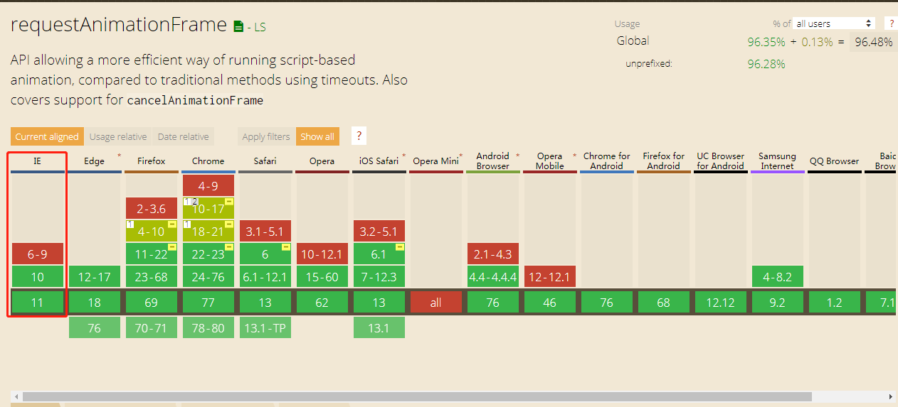
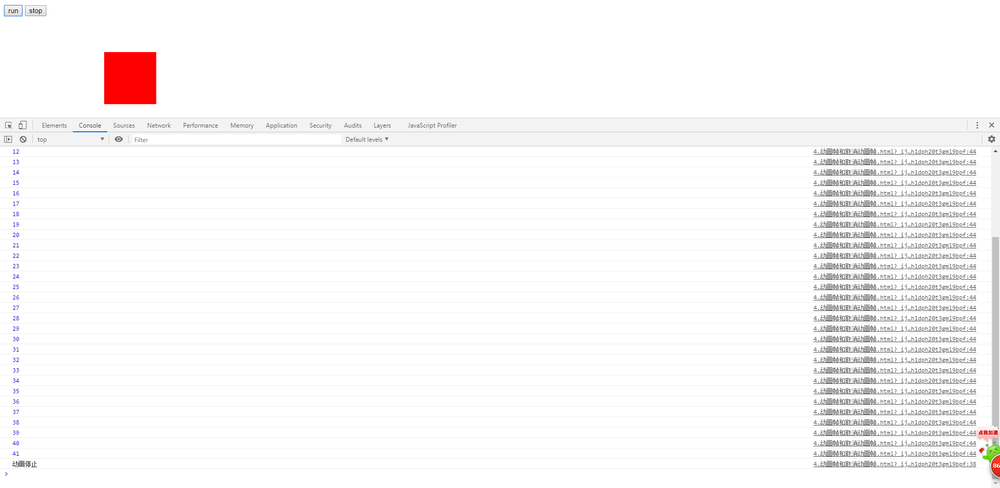

# 利用动画帧做动画

> 知识大纲
* 动画帧只执行一次，需要重复执行，可以使用递归
* requestAnimationFrame返回值动画编号 
* IE10以下就会报错 
    
    

> 练习
1. 直接先上代码
    ```
    <!DOCTYPE html>
    <html lang="en">
    <head>
        <meta charset="UTF-8">
        <title>Title</title>
        <style>
            #box{
                position: absolute;
                left: 0;
                top: 100px;
                width: 100px;
                height: 100px;
                background-color: red;
            }
        </style>
    </head>
    <body>
    <button>run</button>
    <button>stop</button>
    <div id="box"></div>
    <script>
        (function(){
            let aBtn = document.querySelectorAll("button");
            let oBox = document.querySelector("#box");
            let timer = 0;
            aBtn[0].onclick = function(){
                move();
            };
            aBtn[1].onclick = function(){
                cancelAnimationFrame(timer);
            };
    
            function move(){
                cancelAnimationFrame(timer);
                timer = requestAnimationFrame(function(){
                    let l = parseFloat(getComputedStyle(oBox)["left"]);
                    if(l >= 200){
                        console.log("动画停止")
                    }else{
                        oBox.style.left = l + 5 + "px";
                        move();
                    }
                });
                console.log(timer);
            }
        })();
    </script>
    </body>
    </html>
    ```
* 代码其实很简单，演示了个递归的过程，以及如何取消动画帧
* 这里有个逻辑是，当box超过200的时候就不递归执行了，打印动画停止
* 每次执行requestAnimationFrame都会返回个新的动画编号，我们可以根据这个动画编号取消动画帧
* 看下控制台打印的信息 

       

> 目录
* [返回目录](../README.md)
* [上一章-动画帧制作动画的优势(下)](../02-动画帧制作动画的优势(下)/2-动画帧制作动画的优势(下).md)   
* [下一章-动画帧兼容](../04-动画帧兼容/4-动画帧兼容.md)   