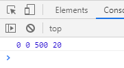
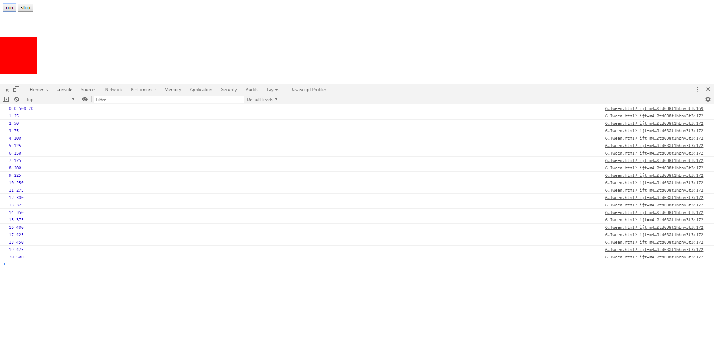
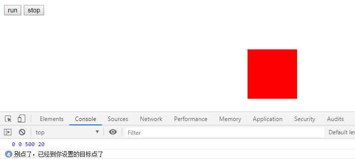
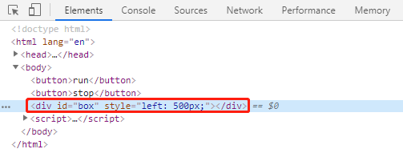

# Tween的运动算法(上)

> 知识大纲
* Tween是一套运动算法，[Tween长撒样](./Tween.js)
* 方法的四个参数
    1. t - 当前时间
    2. b - 初始值
    3. c - 变化量
    4. d - 持续时间
    
> 练习
* 我们先来模拟下这4个参数，先来看代码
    ```
    <!DOCTYPE html>
    <html lang="en">
    <head>
        <meta charset="UTF-8">
        <title>Title</title>
        <style>
            #box{
                position: absolute;
                left: 0;
                top: 100px;
                width: 100px;
                height: 100px;
                background-color: red;
            }
        </style>
    </head>
    <body>
    <button>run</button>
    <button>stop</button>
    <div id="box"></div>
    <script>
        (function(){
            let aBtn = document.querySelectorAll("button");
            let oBox = document.querySelector("#box");
            let t = 0;
            let b = parseFloat(getComputedStyle(oBox)["left"]);
            let target = 500;
            let c = target - b;
            let d = 20;
            console.log(t, b, c, d);
            aBtn[0].onclick = function(){
    
            };
            aBtn[1].onclick = function(){
    
            };
        })();
    </script>
    </body>
    </html>
    ```  
* 案例还是之前那个，主要还是这里设置的4个参数的意义
    1. t - 当前时间，我们可以把这个当做当前第几次动画，初始值为第0次
    2. b - 初始值，那这个在我们本案例中就是我们box元素的初始left的值      
    3. c - 变化值，我们设置了个目标位置500，因为本案例恰巧初始值是0，所以变化值是500，
        但计算的方式，仍然应该是目标点-初始值=变化值
    4. d - 持续时间，我们可以把这个当做动画一共要执行几次，这里设置为20次
* 之后打开控制台就能看到这里的四个参数分别打印了
    
        

* 其实简单的理解就是，希望动画走完20次以后到达目标的地方500  

* 接下来我们给run按钮添加逻辑

    ```
        aBtn[0].onclick = function(){
            t++;
            console.log(t, Tween.linear(t,b,c,d));
        };
    ```
* 我们先模拟下每点击一次走一次，就是按run按钮，理论上按20次就应该到500了，
    这里为了教学，我是真的按了20次，小伙伴们调试其实按几次看下结果就知道了 
    
        
    
* 前面忘记说了linear是Tween里最简单的运动公式，就是我们的匀速运动啦，原理搞懂以后我们就可以
    接着写我们的代码了    
    ```
        aBtn[0].onclick = function(){
            t++;
            // console.log(t, Tween.linear(t,b,c,d));
            if(t <= d){
                let l = Tween.linear(t,b,c,d);
                oBox.style.left = l + "px";
            }else{
                console.log("别点了，已经到你设置的目标点了")
            }
        };
    ```  
* 其实就是给box添加了样式，依然用点击的方式看下效果   

       
    
    
    
* 到这里想必小伙伴都忍不了了吧，可以开始写动画了吧，在通过鼠标点击，让元素走到目标点，肯定要砸电脑了啊，
    那我们在下一章用requestAnimationFrame搞起~

> 目录
* [返回目录](../README.md)
* [上一章-动画帧兼容](../04-动画帧兼容/4-动画帧兼容.md)       
* [下一章-Tween的运动算法(下)](../06-Tween的运动算法(下)/6-Tween的运动算法(下).md)       
