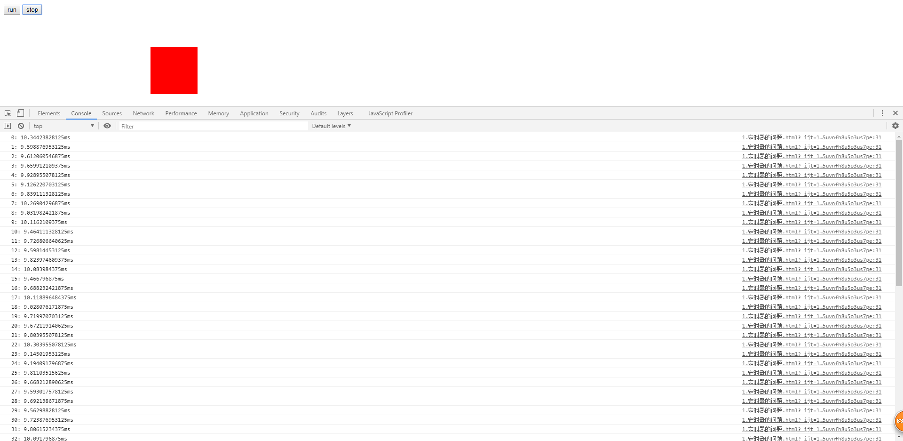

# 动画帧制作动画的优势(上)

> 为什么要使用动画帧
1. requestAnimationFrame会把每一帧中所有DOM操作集中起来，在一次重绘或回流中完成，并且
    重绘或回流的时间间隔紧紧跟随浏览器的刷新频率
2. 在隐藏或不可见的元素中，requestAnimationFrame将不会进行重绘或回流

> API
1. requestAnimationFrame(callback) 动画帧

    * callback - 下一次重回之前更新动画帧所调用的函数
    * 返回值 - 动画帧id

2. cancelAnimationFrame(动画帧id) 取消动画帧

> 和定时器的区别
* 最主要的就是性能上的区别

> 练习
* 先写个简单的案例，具体代码如下
    ```html
    <!DOCTYPE html>
    <html lang="en">
    <head>
        <meta charset="UTF-8">
        <title>Title</title>
        <style>
            #box{
                position: absolute;
                left: 0;
                top: 100px;
                width: 100px;
                height: 100px;
                background-color: red;
            }
        </style>
    </head>
    <body>
        <button>run</button>
        <button>stop</button>
        <div id="box"></div>
        <script>
            (function(){
                let aBtn = document.querySelectorAll("button");
                let oBox = document.querySelector("#box");
                let timer = 0;
                aBtn[0].onclick = function(){
                    clearInterval(timer); //定时器管理，不加这行就会开启多个定时器越点越快
                    timer = setInterval(() => {
                        let l = parseFloat(getComputedStyle(oBox)["left"]);
                        oBox.style.left = l + 5 + "px";
                    }, 10)
                };
                aBtn[1].onclick = function(){
                    clearInterval(timer);
                };
            })();
        </script>
    </body>
    </html>
    ```
* 上述代码其实很简单，就是实现了一个box的移动，点击run按钮，盒子往右移动，点击stop盒子停止，
    再点击run可以继续向右移动
* 有时候我们能看到稍许卡顿，这里我们对代码做个调试，用console.time和console.timeEnd来玩玩，
    具体代码如下
    ```
    (function(){
        let aBtn = document.querySelectorAll("button");
        let oBox = document.querySelector("#box");
        let timer = 0;
        let num = 0;
        aBtn[0].onclick = function(){
            clearInterval(timer); //定时器管理，不加这行就会开启多个定时器越点越快
            console.time(num);
            timer = setInterval(() => {
                console.timeEnd(num);
                let l = parseFloat(getComputedStyle(oBox)["left"]);
                oBox.style.left = l + 5 + "px";
                num ++;
                console.time(num);
            }, 10)

        };
        aBtn[1].onclick = function(){
            clearInterval(timer);
        };
    })();
    ```  
* time和timeEnd就是记录一段代码运行的时间间隔，我们可以看到在点击的时候记录下时间，
    然后在定时器开始的时候记录下结束时间，因为interval会下次继续调用，所以在interval结束的时候,
    我们还需要继续console.time
* 理论上我们的执行间隔是10，但实际上浏览器并不可能是这么个精准的时间，我们来看下打印的信息

    
    
* 这里要说下我们的屏幕刷新率，一般是1秒钟60帧，1000/60=16.6666666666
* 屏幕刷新率是16(这里就假定16)，而我们设置的是10，既可以这么理解
    * 屏幕绘制是 16 32 48 64.... 
        * 16ms的时候绘制一次
        * 32ms的时候绘制一次
        * 48ms的时候绘制一次
        * ...
    * 我们设置的时间 10 20 30 40...
        * 10ms的时候 改变元素样式
        * 20ms的时候 改变元素样式
        * 30ms的时候 改变元素样式
        * ...
    * 在我们10毫秒改变元素样式的时候，等到16的时候屏幕渲染就没问题
    * 然后我们看到屏幕刷新率到32的这个时候，其实我们这边丢了一帧，因为20，30，在16和32之间
        有这么两件事(event loop的原理，两件事指的就是20，30)，20的并没有立刻绘制，是等到30直接绘制30的那个样式
        所以相当于丢帧了，于是就看出来卡顿了 
        
* 所以卡顿的真相
    1. 时间间隔并不准确
    2. 会丢帧  
    

> 目录
* [返回目录](../README.md)
* [下一章-动画帧制作动画的优势(下)](../2-动画帧制作动画的优势(下)/动画帧制作动画的优势(下).md)   

          
         
            
        