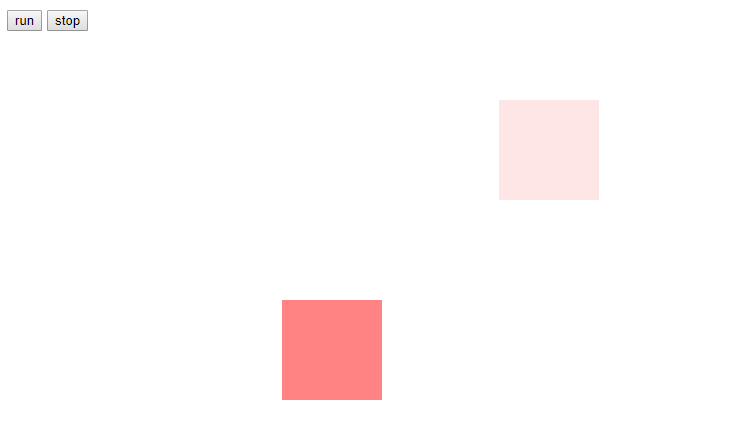
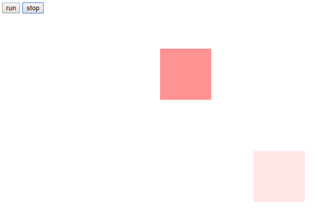

# 动画管理

> 概念
1. 页面中有个run的按钮，点击后可以开始动画
2. 还有个stop按钮，其实就想把动画停止，取消动画帧
3. 开启和关闭，这个我们称为动画管理，接下去我们就要再次封装下框架

> 练习
* 首先先来个错误示范
    ```
    <!DOCTYPE html>
    <html lang="en">
    <head>
        <meta charset="UTF-8">
        <title>Title</title>
        <style>
            #box {
                position: absolute;
                left: 0;
                top: 100px;
                width: 100px;
                height: 100px;
                background-color: red;
                opacity: 1;
            }
        </style>
    </head>
    <body>
    <button>run</button>
    <button>stop</button>
    <div id="box"></div>
    <script>
        const Tween = {
            linear: function (t, b, c, d) {  //匀速
                return c * t / d + b;
            },
            easeIn: function (t, b, c, d) {  //加速曲线
                return c * (t /= d) * t + b;
            },
            easeOut: function (t, b, c, d) {  //减速曲线
                return -c * (t /= d) * (t - 2) + b;
            },
            easeBoth: function (t, b, c, d) {  //加速减速曲线
                if ((t /= d / 2) < 1) {
                    return c / 2 * t * t + b;
                }
                return -c / 2 * ((--t) * (t - 2) - 1) + b;
            },
            easeInStrong: function (t, b, c, d) {  //加加速曲线
                return c * (t /= d) * t * t * t + b;
            },
            easeOutStrong: function (t, b, c, d) {  //减减速曲线
                return -c * ((t = t / d - 1) * t * t * t - 1) + b;
            },
            easeBothStrong: function (t, b, c, d) {  //加加速减减速曲线
                if ((t /= d / 2) < 1) {
                    return c / 2 * t * t * t * t + b;
                }
                return -c / 2 * ((t -= 2) * t * t * t - 2) + b;
            },
            elasticIn: function (t, b, c, d, a, p) {  //正弦衰减曲线（弹动渐入）
                if (t === 0) {
                    return b;
                }
                if ((t /= d) == 1) {
                    return b + c;
                }
                if (!p) {
                    p = d * 0.3;
                }
                if (!a || a < Math.abs(c)) {
                    a = c;
                    var s = p / 4;
                } else {
                    var s = p / (2 * Math.PI) * Math.asin(c / a);
                }
                return -(a * Math.pow(2, 10 * (t -= 1)) * Math.sin((t * d - s) * (2 * Math.PI) / p)) + b;
            },
            elasticOut: function (t, b, c, d, a, p) {    //正弦增强曲线（弹动渐出）
                if (t === 0) {
                    return b;
                }
                if ((t /= d) == 1) {
                    return b + c;
                }
                if (!p) {
                    p = d * 0.3;
                }
                if (!a || a < Math.abs(c)) {
                    a = c;
                    var s = p / 4;
                } else {
                    var s = p / (2 * Math.PI) * Math.asin(c / a);
                }
                return a * Math.pow(2, -10 * t) * Math.sin((t * d - s) * (2 * Math.PI) / p) + c + b;
            },
            elasticBoth: function (t, b, c, d, a, p) {
                if (t === 0) {
                    return b;
                }
                if ((t /= d / 2) == 2) {
                    return b + c;
                }
                if (!p) {
                    p = d * (0.3 * 1.5);
                }
                if (!a || a < Math.abs(c)) {
                    a = c;
                    var s = p / 4;
                } else {
                    var s = p / (2 * Math.PI) * Math.asin(c / a);
                }
                if (t < 1) {
                    return -0.5 * (a * Math.pow(2, 10 * (t -= 1)) *
                        Math.sin((t * d - s) * (2 * Math.PI) / p)) + b;
                }
                return a * Math.pow(2, -10 * (t -= 1)) *
                    Math.sin((t * d - s) * (2 * Math.PI) / p) * 0.5 + c + b;
            },
            backIn: function (t, b, c, d, s) {     //回退加速（回退渐入）
                if (typeof s == 'undefined') {
                    s = 1.70158;
                }
                return c * (t /= d) * t * ((s + 1) * t - s) + b;
            },
            backOut: function (t, b, c, d, s) {
                if (typeof s == 'undefined') {
                    s = 1.70158;
                }
                return c * ((t = t / d - 1) * t * ((s + 1) * t + s) + 1) + b;
            },
            backBoth: function (t, b, c, d, s) {
                if (typeof s == 'undefined') {
                    s = 1.70158;
                }
                if ((t /= d / 2) < 1) {
                    return c / 2 * (t * t * (((s *= (1.525)) + 1) * t - s)) + b;
                }
                return c / 2 * ((t -= 2) * t * (((s *= (1.525)) + 1) * t + s) + 2) + b;
            },
            bounceIn: function (t, b, c, d) {    //弹球减振（弹球渐出）
                return c - Tween['bounceOut'](d - t, 0, c, d) + b;
            },
            bounceOut: function (t, b, c, d) {//*
                if ((t /= d) < (1 / 2.75)) {
                    return c * (7.5625 * t * t) + b;
                } else if (t < (2 / 2.75)) {
                    return c * (7.5625 * (t -= (1.5 / 2.75)) * t + 0.75) + b;
                } else if (t < (2.5 / 2.75)) {
                    return c * (7.5625 * (t -= (2.25 / 2.75)) * t + 0.9375) + b;
                }
                return c * (7.5625 * (t -= (2.625 / 2.75)) * t + 0.984375) + b;
            },
            bounceBoth: function (t, b, c, d) {
                if (t < d / 2) {
                    return Tween['bounceIn'](t * 2, 0, c, d) * 0.5 + b;
                }
                return Tween['bounceOut'](t * 2 - d, 0, c, d) * 0.5 + c * 0.5 + b;
            }
        };
        (function () {
            if (!window.requestAnimationFrame) {
                //说明这个是低版本
                window.requestAnimationFrame = function (callback) {
                    return setTimeout(callback, 1000 / 60)
                };
                window.cancelAnimationFrame = function (index) {
                    clearTimeout(index);
                };
            }
        })();
    
        function css(el, attr, val) {
            if (val === undefined) {
                return parseFloat(getComputedStyle(el)[attr]);
            } else {
                if (attr === "opacity") {
                    el.style[attr] = val;
                    el.style.filter = `alpha(opacity=${val * 100})`;//兼容
                } else {
                    el.style[attr] = val + "px";
                }
            }
        }
    
        function myTween(el, attr, duration, fx) {
            let t = 0;
            // let b = css(el, attr); //通过css方法获取样式
            // let c = target - b;
            let b = {};
            let c = {};
            for (let key in attr) {
                b[key] = css(el, key);
                c[key] = attr[key] - b[key];
            }
            // console.log(b);
            // console.log(attr);
            // console.log(c);
            let d = Math.ceil(duration / (1000 / 60));
            // console.log(t, b, c, d);
            let timer = 0;
            anim();
    
            function anim() {
                t++;
                if (t > d) {
                    //动画结束
                    cancelAnimationFrame(timer);
                } else {
                    for (let key in attr) {
                        let val = Tween[fx](t, b[key], c[key], d);
                        css(el, key, val); //通过css方法设置样式
                    }
                    timer = requestAnimationFrame(anim);
                }
            }
        }
    
        (function () {
            let aBtn = document.querySelectorAll("button");
            let oBox = document.querySelector("#box");
            aBtn[0].onclick = function () {
                // myTween(oBox, "top", 200, 500, "linear");
                // myTween(oBox, "opacity", .1, 500, "linear")
                myTween(oBox, {
                    top: 200,
                    opacity: .1
                }, 500, "linear")
            }
    
            aBtn[1].onclick = function () {
                cancelAnimationFrame(timer);
            }
        })()
    </script>
    </body>
    </html>
    ```
  
* 我们就点击stop按钮，取消动画帧传入timer，实际上这里就报错了，原因很简单，因为我们的timer是写在myTween方法中的，
    这个时候小伙伴可能又说，那我们写在全局不就可以了，其实也是不合理的，因为全局下就一个timer，如果多个元素要做动画，
     这个管理上就有问题

* 眼见为实，我们来测试下，把timer先放在全局下，然后搞第二个box   
    ```
    <!DOCTYPE html>
    <html lang="en">
    <head>
        <meta charset="UTF-8">
        <title>Title</title>
        <style>
            #box, #box2{
                position: absolute;
                left: 0;
                top: 100px;
                width: 100px;
                height: 100px;
                background-color: red;
                opacity: 1;
            }
            #box2{
                top: 300px;
            }
        </style>
    </head>
    <body>
    <button>run</button>
    <button>stop</button>
    <div id="box"></div>
    <div id="box2"></div>
    <script>
        const Tween = {
            linear: function (t, b, c, d) {  //匀速
                return c * t / d + b;
            },
            easeIn: function (t, b, c, d) {  //加速曲线
                return c * (t /= d) * t + b;
            },
            easeOut: function (t, b, c, d) {  //减速曲线
                return -c * (t /= d) * (t - 2) + b;
            },
            easeBoth: function (t, b, c, d) {  //加速减速曲线
                if ((t /= d / 2) < 1) {
                    return c / 2 * t * t + b;
                }
                return -c / 2 * ((--t) * (t - 2) - 1) + b;
            },
            easeInStrong: function (t, b, c, d) {  //加加速曲线
                return c * (t /= d) * t * t * t + b;
            },
            easeOutStrong: function (t, b, c, d) {  //减减速曲线
                return -c * ((t = t / d - 1) * t * t * t - 1) + b;
            },
            easeBothStrong: function (t, b, c, d) {  //加加速减减速曲线
                if ((t /= d / 2) < 1) {
                    return c / 2 * t * t * t * t + b;
                }
                return -c / 2 * ((t -= 2) * t * t * t - 2) + b;
            },
            elasticIn: function (t, b, c, d, a, p) {  //正弦衰减曲线（弹动渐入）
                if (t === 0) {
                    return b;
                }
                if ((t /= d) == 1) {
                    return b + c;
                }
                if (!p) {
                    p = d * 0.3;
                }
                if (!a || a < Math.abs(c)) {
                    a = c;
                    var s = p / 4;
                } else {
                    var s = p / (2 * Math.PI) * Math.asin(c / a);
                }
                return -(a * Math.pow(2, 10 * (t -= 1)) * Math.sin((t * d - s) * (2 * Math.PI) / p)) + b;
            },
            elasticOut: function (t, b, c, d, a, p) {    //正弦增强曲线（弹动渐出）
                if (t === 0) {
                    return b;
                }
                if ((t /= d) == 1) {
                    return b + c;
                }
                if (!p) {
                    p = d * 0.3;
                }
                if (!a || a < Math.abs(c)) {
                    a = c;
                    var s = p / 4;
                } else {
                    var s = p / (2 * Math.PI) * Math.asin(c / a);
                }
                return a * Math.pow(2, -10 * t) * Math.sin((t * d - s) * (2 * Math.PI) / p) + c + b;
            },
            elasticBoth: function (t, b, c, d, a, p) {
                if (t === 0) {
                    return b;
                }
                if ((t /= d / 2) == 2) {
                    return b + c;
                }
                if (!p) {
                    p = d * (0.3 * 1.5);
                }
                if (!a || a < Math.abs(c)) {
                    a = c;
                    var s = p / 4;
                } else {
                    var s = p / (2 * Math.PI) * Math.asin(c / a);
                }
                if (t < 1) {
                    return -0.5 * (a * Math.pow(2, 10 * (t -= 1)) *
                        Math.sin((t * d - s) * (2 * Math.PI) / p)) + b;
                }
                return a * Math.pow(2, -10 * (t -= 1)) *
                    Math.sin((t * d - s) * (2 * Math.PI) / p) * 0.5 + c + b;
            },
            backIn: function (t, b, c, d, s) {     //回退加速（回退渐入）
                if (typeof s == 'undefined') {
                    s = 1.70158;
                }
                return c * (t /= d) * t * ((s + 1) * t - s) + b;
            },
            backOut: function (t, b, c, d, s) {
                if (typeof s == 'undefined') {
                    s = 1.70158;
                }
                return c * ((t = t / d - 1) * t * ((s + 1) * t + s) + 1) + b;
            },
            backBoth: function (t, b, c, d, s) {
                if (typeof s == 'undefined') {
                    s = 1.70158;
                }
                if ((t /= d / 2) < 1) {
                    return c / 2 * (t * t * (((s *= (1.525)) + 1) * t - s)) + b;
                }
                return c / 2 * ((t -= 2) * t * (((s *= (1.525)) + 1) * t + s) + 2) + b;
            },
            bounceIn: function (t, b, c, d) {    //弹球减振（弹球渐出）
                return c - Tween['bounceOut'](d - t, 0, c, d) + b;
            },
            bounceOut: function (t, b, c, d) {//*
                if ((t /= d) < (1 / 2.75)) {
                    return c * (7.5625 * t * t) + b;
                } else if (t < (2 / 2.75)) {
                    return c * (7.5625 * (t -= (1.5 / 2.75)) * t + 0.75) + b;
                } else if (t < (2.5 / 2.75)) {
                    return c * (7.5625 * (t -= (2.25 / 2.75)) * t + 0.9375) + b;
                }
                return c * (7.5625 * (t -= (2.625 / 2.75)) * t + 0.984375) + b;
            },
            bounceBoth: function (t, b, c, d) {
                if (t < d / 2) {
                    return Tween['bounceIn'](t * 2, 0, c, d) * 0.5 + b;
                }
                return Tween['bounceOut'](t * 2 - d, 0, c, d) * 0.5 + c * 0.5 + b;
            }
        };
        (function () {
            if (!window.requestAnimationFrame) {
                //说明这个是低版本
                window.requestAnimationFrame = function (callback) {
                    return setTimeout(callback, 1000 / 60)
                };
                window.cancelAnimationFrame = function (index) {
                    clearTimeout(index);
                };
            }
        })();
    
        function css(el, attr, val) {
            if (val === undefined) {
                return parseFloat(getComputedStyle(el)[attr]);
            } else {
                if (attr === "opacity") {
                    el.style[attr] = val;
                    el.style.filter = `alpha(opacity=${val * 100})`;//兼容
                } else {
                    el.style[attr] = val + "px";
                }
            }
        }
    
        let timer = 0;
        function myTween(el, attr, duration, fx) {
            let t = 0;
            // let b = css(el, attr); //通过css方法获取样式
            // let c = target - b;
            let b = {};
            let c = {};
            for (let key in attr) {
                b[key] = css(el, key);
                c[key] = attr[key] - b[key];
            }
            // console.log(b);
            // console.log(attr);
            // console.log(c);
            let d = Math.ceil(duration / (1000 / 60));
            // console.log(t, b, c, d);
            anim();
    
            function anim() {
                t++;
                if (t > d) {
                    //动画结束
                    cancelAnimationFrame(timer);
                } else {
                    for (let key in attr) {
                        let val = Tween[fx](t, b[key], c[key], d);
                        css(el, key, val); //通过css方法设置样式
                    }
                    timer = requestAnimationFrame(anim);
                }
            }
        }
    
        (function () {
            let aBtn = document.querySelectorAll("button");
            let oBox = document.querySelector("#box");
            let oBox2 = document.querySelector("#box2");
            aBtn[0].onclick = function () {
                // myTween(oBox, "top", 200, 500, "linear");
                // myTween(oBox, "opacity", .1, 500, "linear")
                myTween(oBox, {
                    left: 500,
                    opacity: .1
                }, 500, "linear")
                myTween(oBox2, {
                    left: 500,
                    opacity: .1
                }, 500, "linear")
            }
    
            aBtn[1].onclick = function () {
                cancelAnimationFrame(timer);
            }
        })()
    </script>
    </body>
    </html>
    ``` 

* 然后运行一把先点击run，在点击stop

    
    
* 我们发现第二个盒子是停下来了，但第一个盒子动画还是走完了，这个就是放全局下的问题，停的是之后写的盒子2,
    原理其实就是第二个盒子的timer把第一个盒子覆盖掉了，所以停止的是第二个盒子
* 那如何停止第一个盒子，让第二个盒子继续动画呢，其实我们把timer和el元素挂钩就可以了
* 我们把全局的timer删了，然后开启动画帧的时候只要在前面加`el.animationTimer = requestAnimationFrame()`就可以了
* 具体代码如下    
    ```
    <!DOCTYPE html>
    <html lang="en">
    <head>
        <meta charset="UTF-8">
        <title>Title</title>
        <style>
            #box, #box2{
                position: absolute;
                left: 0;
                top: 100px;
                width: 100px;
                height: 100px;
                background-color: red;
                opacity: 1;
            }
            #box2{
                top: 300px;
            }
        </style>
    </head>
    <body>
    <button>run</button>
    <button>stop</button>
    <div id="box"></div>
    <div id="box2"></div>
    <script>
        const Tween = {
            linear: function (t, b, c, d) {  //匀速
                return c * t / d + b;
            },
            easeIn: function (t, b, c, d) {  //加速曲线
                return c * (t /= d) * t + b;
            },
            easeOut: function (t, b, c, d) {  //减速曲线
                return -c * (t /= d) * (t - 2) + b;
            },
            easeBoth: function (t, b, c, d) {  //加速减速曲线
                if ((t /= d / 2) < 1) {
                    return c / 2 * t * t + b;
                }
                return -c / 2 * ((--t) * (t - 2) - 1) + b;
            },
            easeInStrong: function (t, b, c, d) {  //加加速曲线
                return c * (t /= d) * t * t * t + b;
            },
            easeOutStrong: function (t, b, c, d) {  //减减速曲线
                return -c * ((t = t / d - 1) * t * t * t - 1) + b;
            },
            easeBothStrong: function (t, b, c, d) {  //加加速减减速曲线
                if ((t /= d / 2) < 1) {
                    return c / 2 * t * t * t * t + b;
                }
                return -c / 2 * ((t -= 2) * t * t * t - 2) + b;
            },
            elasticIn: function (t, b, c, d, a, p) {  //正弦衰减曲线（弹动渐入）
                if (t === 0) {
                    return b;
                }
                if ((t /= d) == 1) {
                    return b + c;
                }
                if (!p) {
                    p = d * 0.3;
                }
                if (!a || a < Math.abs(c)) {
                    a = c;
                    var s = p / 4;
                } else {
                    var s = p / (2 * Math.PI) * Math.asin(c / a);
                }
                return -(a * Math.pow(2, 10 * (t -= 1)) * Math.sin((t * d - s) * (2 * Math.PI) / p)) + b;
            },
            elasticOut: function (t, b, c, d, a, p) {    //正弦增强曲线（弹动渐出）
                if (t === 0) {
                    return b;
                }
                if ((t /= d) == 1) {
                    return b + c;
                }
                if (!p) {
                    p = d * 0.3;
                }
                if (!a || a < Math.abs(c)) {
                    a = c;
                    var s = p / 4;
                } else {
                    var s = p / (2 * Math.PI) * Math.asin(c / a);
                }
                return a * Math.pow(2, -10 * t) * Math.sin((t * d - s) * (2 * Math.PI) / p) + c + b;
            },
            elasticBoth: function (t, b, c, d, a, p) {
                if (t === 0) {
                    return b;
                }
                if ((t /= d / 2) == 2) {
                    return b + c;
                }
                if (!p) {
                    p = d * (0.3 * 1.5);
                }
                if (!a || a < Math.abs(c)) {
                    a = c;
                    var s = p / 4;
                } else {
                    var s = p / (2 * Math.PI) * Math.asin(c / a);
                }
                if (t < 1) {
                    return -0.5 * (a * Math.pow(2, 10 * (t -= 1)) *
                        Math.sin((t * d - s) * (2 * Math.PI) / p)) + b;
                }
                return a * Math.pow(2, -10 * (t -= 1)) *
                    Math.sin((t * d - s) * (2 * Math.PI) / p) * 0.5 + c + b;
            },
            backIn: function (t, b, c, d, s) {     //回退加速（回退渐入）
                if (typeof s == 'undefined') {
                    s = 1.70158;
                }
                return c * (t /= d) * t * ((s + 1) * t - s) + b;
            },
            backOut: function (t, b, c, d, s) {
                if (typeof s == 'undefined') {
                    s = 1.70158;
                }
                return c * ((t = t / d - 1) * t * ((s + 1) * t + s) + 1) + b;
            },
            backBoth: function (t, b, c, d, s) {
                if (typeof s == 'undefined') {
                    s = 1.70158;
                }
                if ((t /= d / 2) < 1) {
                    return c / 2 * (t * t * (((s *= (1.525)) + 1) * t - s)) + b;
                }
                return c / 2 * ((t -= 2) * t * (((s *= (1.525)) + 1) * t + s) + 2) + b;
            },
            bounceIn: function (t, b, c, d) {    //弹球减振（弹球渐出）
                return c - Tween['bounceOut'](d - t, 0, c, d) + b;
            },
            bounceOut: function (t, b, c, d) {//*
                if ((t /= d) < (1 / 2.75)) {
                    return c * (7.5625 * t * t) + b;
                } else if (t < (2 / 2.75)) {
                    return c * (7.5625 * (t -= (1.5 / 2.75)) * t + 0.75) + b;
                } else if (t < (2.5 / 2.75)) {
                    return c * (7.5625 * (t -= (2.25 / 2.75)) * t + 0.9375) + b;
                }
                return c * (7.5625 * (t -= (2.625 / 2.75)) * t + 0.984375) + b;
            },
            bounceBoth: function (t, b, c, d) {
                if (t < d / 2) {
                    return Tween['bounceIn'](t * 2, 0, c, d) * 0.5 + b;
                }
                return Tween['bounceOut'](t * 2 - d, 0, c, d) * 0.5 + c * 0.5 + b;
            }
        };
        (function () {
            if (!window.requestAnimationFrame) {
                //说明这个是低版本
                window.requestAnimationFrame = function (callback) {
                    return setTimeout(callback, 1000 / 60)
                };
                window.cancelAnimationFrame = function (index) {
                    clearTimeout(index);
                };
            }
        })();
    
        function css(el, attr, val) {
            if (val === undefined) {
                return parseFloat(getComputedStyle(el)[attr]);
            } else {
                if (attr === "opacity") {
                    el.style[attr] = val;
                    el.style.filter = `alpha(opacity=${val * 100})`;//兼容
                } else {
                    el.style[attr] = val + "px";
                }
            }
        }
    
        function myTween(el, attr, duration, fx) {
            let t = 0;
            // let b = css(el, attr); //通过css方法获取样式
            // let c = target - b;
            let b = {};
            let c = {};
            for (let key in attr) {
                b[key] = css(el, key);
                c[key] = attr[key] - b[key];
            }
            // console.log(b);
            // console.log(attr);
            // console.log(c);
            let d = Math.ceil(duration / (1000 / 60));
            // console.log(t, b, c, d);
            anim();
    
            function anim() {
                t++;
                if (t > d) {
                    //动画结束
                    cancelAnimationFrame(el.animationTimer);
                } else {
                    for (let key in attr) {
                        let val = Tween[fx](t, b[key], c[key], d);
                        css(el, key, val); //通过css方法设置样式
                    }
                    el.animationTimer = requestAnimationFrame(anim);
                }
            }
        }
    
        (function () {
            let aBtn = document.querySelectorAll("button");
            let oBox = document.querySelector("#box");
            let oBox2 = document.querySelector("#box2");
            aBtn[0].onclick = function () {
                // myTween(oBox, "top", 200, 500, "linear");
                // myTween(oBox, "opacity", .1, 500, "linear")
                myTween(oBox, {
                    left: 500,
                    opacity: .1
                }, 500, "linear")
                myTween(oBox2, {
                    left: 500,
                    opacity: .1
                }, 500, "linear")
            }
    
            aBtn[1].onclick = function () {
                cancelAnimationFrame(oBox.animationTimer);
            }
        })()
    </script>
    </body>
    </html>
    ```
* 注意这里我们停的就是第一个box 
    ```
    aBtn[1].onclick = function () {
        cancelAnimationFrame(oBox.animationTimer);
    }
    ```
   
    
 
* 这样就大功告成了，如果2个都想停止，其实这样写就可以了
    ```
    aBtn[1].onclick = function () {
        cancelAnimationFrame(oBox.animationTimer);
        cancelAnimationFrame(oBox2.animationTimer);
    }
    ```   
* 但这样写其实还是不专业，我们可以在优化下给myTween添加个方法   
    ```
    myTween.stop = function(el){
        cancelAnimationFrame(el.animationTimer);
    };
    ```

* 这样就完美了，代码可以这么写
    ```
    aBtn[1].onclick = function () {
        // cancelAnimationFrame(oBox.animationTimer);
        // cancelAnimationFrame(oBox2.animationTimer);
        myTween.stop(oBox);
        myTween.stop(oBox2);
    }   
    ```  
    
* 多次点击run的问题，这边可以在进行个优化,具体代码如下
    ```
    <!DOCTYPE html>
    <html lang="en">
    <head>
        <meta charset="UTF-8">
        <title>Title</title>
        <style>
            #box, #box2{
                position: absolute;
                left: 0;
                top: 100px;
                width: 100px;
                height: 100px;
                background-color: red;
                opacity: 1;
            }
            #box2{
                top: 300px;
            }
        </style>
    </head>
    <body>
    <button>run</button>
    <button>stop</button>
    <div id="box"></div>
    <div id="box2"></div>
    <script src="./Tween.js"></script>
    <script>
        (function () {
            if (!window.requestAnimationFrame) {
                //说明这个是低版本
                window.requestAnimationFrame = function (callback) {
                    return setTimeout(callback, 1000 / 60)
                };
                window.cancelAnimationFrame = function (index) {
                    clearTimeout(index);
                };
            }
        })();
    
        function css(el, attr, val) {
            if (val === undefined) {
                return parseFloat(getComputedStyle(el)[attr]);
            } else {
                if (attr === "opacity") {
                    el.style[attr] = val;
                    el.style.filter = `alpha(opacity=${val * 100})`;//兼容
                } else {
                    el.style[attr] = val + "px";
                }
            }
        }
    
        function myTween(el, attr, duration, fx) {
            if(el.animationTimer){
                return;
            }
            let t = 0;
            // let b = css(el, attr); //通过css方法获取样式
            // let c = target - b;
            let b = {};
            let c = {};
            for (let key in attr) {
                b[key] = css(el, key);
                c[key] = attr[key] - b[key];
            }
            // console.log(b);
            // console.log(attr);
            // console.log(c);
            let d = Math.ceil(duration / (1000 / 60));
            // console.log(t, b, c, d);
            anim();
    
            function anim() {
                t++;
                if (t > d) {
                    //动画结束
                    cancelAnimationFrame(el.animationTimer);
                    el.animationTimer = null;
                } else {
                    for (let key in attr) {
                        let val = Tween[fx](t, b[key], c[key], d);
                        css(el, key, val); //通过css方法设置样式
                    }
                    el.animationTimer = requestAnimationFrame(anim);
                }
            }
        }
    
        myTween.stop = function(el){
            cancelAnimationFrame(el.animationTimer);
            el.animationTimer = null;
        };
    
        (function () {
            let aBtn = document.querySelectorAll("button");
            let oBox = document.querySelector("#box");
            let oBox2 = document.querySelector("#box2");
            aBtn[0].onclick = function () {
                // myTween(oBox, "top", 200, 500, "linear");
                // myTween(oBox, "opacity", .1, 500, "linear")
                myTween(oBox, {
                    left: 500,
                    opacity: .1
                }, 500, "linear")
                myTween(oBox2, {
                    left: 500,
                    opacity: .1
                }, 500, "linear")
            };
    
            aBtn[1].onclick = function () {
                // cancelAnimationFrame(oBox.animationTimer);
                // cancelAnimationFrame(oBox2.animationTimer);
                myTween.stop(oBox);
                myTween.stop(oBox2);
            }
        })()
    </script>
    </body>
    </html>
    ```    
    
* 在myTween一开始调用时，判断元素属性中存不存在animationTimer，存在说明开启过了，就直接return
* 在动画结束后，把判断元素属性中存不存在animationTimer赋值为null    
  
> 目录
* [返回目录](../README.md)
* [上一章-多样式动画](../9-多样式动画/9-多样式动画.md)   
   