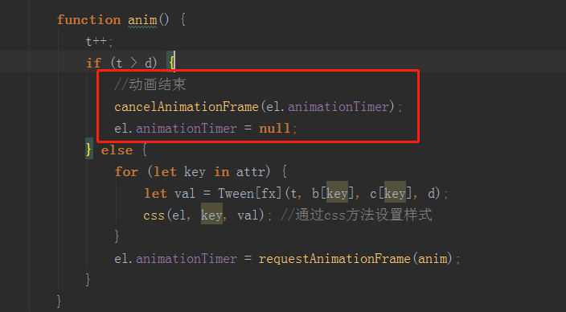

# 添加回调函数

> 思路
* 其实就是为了解决这样一个需求
    * 一个动画结束后在执行下一个动画
    * 下一个动画执行后在执行下一个动画
    * 或者说需要做其他事情等等
* 所以需要添加一个回调函数  

> 练习 
* 什么是回调函数 
    * 先简单的来解释下什么是回调函数，其实概念一堆，最简单的就是这么个演示
        ```
            function fn(cb){
                cb();
            }
            function fn2(){
                alert(1);
            }
            fn(fn2);
        ```
    * 我们可以看到，我们定义了2个函数，fn这个函数的参数是个函数，然后fn中的逻辑就是执行这个传入的函数
    * 这里我们就可以成为fn2是回调函数，它并不是自己直接执行，而是通过fn，传入后在执行
    * 所以这边的执行fn，把fn2传入，自然而然就执行了fn2，并且alert了1
* 用回调函数搞定东西玩玩(动画结束之后搞点事情)   
    * 首先要明确我们要在哪里添加回调函数，自然是动画结束后，所以是在这里之后
    
           
        
    * 然后我们依然是在option参数里添加一个cb，作为回调函数    
    
        ```
        function myTween(option) {
                //el, attr, duration, fx
                let {el, attr, duration = 500, fx = "linear", cb} = option;
                if(el.animationTimer){
                    return;
                }
                let t = 0;
                // let b = css(el, attr); //通过css方法获取样式
                // let c = target - b;
                let b = {};
                let c = {};
                for (let key in attr) {
                    b[key] = css(el, key);
                    c[key] = attr[key] - b[key];
                }
                // console.log(b);
                // console.log(attr);
                // console.log(c);
                let d = Math.ceil(duration / (1000 / 60));
                // console.log(t, b, c, d);
                anim();
        
                function anim() {
                    t++;
                    if (t > d) {
                        //动画结束
                        cancelAnimationFrame(el.animationTimer);
                        el.animationTimer = null;
                        cb && cb();
                    } else {
                        for (let key in attr) {
                            let val = Tween[fx](t, b[key], c[key], d);
                            css(el, key, val); //通过css方法设置样式
                        }
                        el.animationTimer = requestAnimationFrame(anim);
                    }
                }
            }
        ```  
    * 注意动画结束后，要判断cb是否存在，存在回调函数则调用
    * 这样我们就可以这么玩了，在box1动画结束后，在执行box2的动画  
        ```
            aBtn[0].onclick = function () {
                myTween({
                    el: oBox,
                    attr: {
                        left: 500,
                        opacity: .1
                    },
                    cb: function(){
                        myTween({
                            el: oBox2,
                            attr: {
                                left: 500,
                                opacity: .1
                            },
                            duration: 500,
                            fx: "linear"
                        })
                    }
                });
            };
        ```
    * 运行一把完全ok，然后我们可以一直嵌套玩耍，比如让box1走个正方形  
    
        ```
            aBtn[0].onclick = function () {
                myTween({
                    el: oBox,
                    attr: {
                        left: 500,
                        opacity: .1
                    },
                    cb(){
                        myTween({
                            el: oBox,
                            attr: {
                                top: 500,
                                opacity: 1
                            },
                            duration: 500,
                            fx: "linear",
                            cb(){
                                myTween({
                                    el: oBox,
                                    attr: {
                                        left: 0,
                                        opacity: .1
                                    },
                                    duration: 500,
                                    fx: "linear",
                                    cb(){
                                        myTween({
                                            el: oBox,
                                            attr: {
                                                top: 100,
                                                opacity: 1
                                            },
                                            duration: 500,
                                            fx: "linear",
                                            cb(){
                                                console.log("任务完成");
                                            }
                                        })
                                    }
                                })
                            }
                        })
                    }
                });
            };
        ```  
    * 但这样就回调地狱了，后续我们会用promise在进行优化，这边先用其他方式简单的处理下
        1. 先把代码简单封装在一个myTween中，myTween的代码如下
            ```
            const Tween = {
                linear: function (t, b, c, d) {  //匀速
                    return c * t / d + b;
                },
                easeIn: function (t, b, c, d) {  //加速曲线
                    return c * (t /= d) * t + b;
                },
                easeOut: function (t, b, c, d) {  //减速曲线
                    return -c * (t /= d) * (t - 2) + b;
                },
                easeBoth: function (t, b, c, d) {  //加速减速曲线
                    if ((t /= d / 2) < 1) {
                        return c / 2 * t * t + b;
                    }
                    return -c / 2 * ((--t) * (t - 2) - 1) + b;
                },
                easeInStrong: function (t, b, c, d) {  //加加速曲线
                    return c * (t /= d) * t * t * t + b;
                },
                easeOutStrong: function (t, b, c, d) {  //减减速曲线
                    return -c * ((t = t / d - 1) * t * t * t - 1) + b;
                },
                easeBothStrong: function (t, b, c, d) {  //加加速减减速曲线
                    if ((t /= d / 2) < 1) {
                        return c / 2 * t * t * t * t + b;
                    }
                    return -c / 2 * ((t -= 2) * t * t * t - 2) + b;
                },
                elasticIn: function (t, b, c, d, a, p) {  //正弦衰减曲线（弹动渐入）
                    if (t === 0) {
                        return b;
                    }
                    if ((t /= d) == 1) {
                        return b + c;
                    }
                    if (!p) {
                        p = d * 0.3;
                    }
                    if (!a || a < Math.abs(c)) {
                        a = c;
                        var s = p / 4;
                    } else {
                        var s = p / (2 * Math.PI) * Math.asin(c / a);
                    }
                    return -(a * Math.pow(2, 10 * (t -= 1)) * Math.sin((t * d - s) * (2 * Math.PI) / p)) + b;
                },
                elasticOut: function (t, b, c, d, a, p) {    //正弦增强曲线（弹动渐出）
                    if (t === 0) {
                        return b;
                    }
                    if ((t /= d) == 1) {
                        return b + c;
                    }
                    if (!p) {
                        p = d * 0.3;
                    }
                    if (!a || a < Math.abs(c)) {
                        a = c;
                        var s = p / 4;
                    } else {
                        var s = p / (2 * Math.PI) * Math.asin(c / a);
                    }
                    return a * Math.pow(2, -10 * t) * Math.sin((t * d - s) * (2 * Math.PI) / p) + c + b;
                },
                elasticBoth: function (t, b, c, d, a, p) {
                    if (t === 0) {
                        return b;
                    }
                    if ((t /= d / 2) == 2) {
                        return b + c;
                    }
                    if (!p) {
                        p = d * (0.3 * 1.5);
                    }
                    if (!a || a < Math.abs(c)) {
                        a = c;
                        var s = p / 4;
                    }
                    else {
                        var s = p / (2 * Math.PI) * Math.asin(c / a);
                    }
                    if (t < 1) {
                        return -0.5 * (a * Math.pow(2, 10 * (t -= 1)) *
                            Math.sin((t * d - s) * (2 * Math.PI) / p)) + b;
                    }
                    return a * Math.pow(2, -10 * (t -= 1)) *
                        Math.sin((t * d - s) * (2 * Math.PI) / p) * 0.5 + c + b;
                },
                backIn: function (t, b, c, d, s) {     //回退加速（回退渐入）
                    if (typeof s == 'undefined') {
                        s = 1.70158;
                    }
                    return c * (t /= d) * t * ((s + 1) * t - s) + b;
                },
                backOut: function (t, b, c, d, s) {
                    if (typeof s == 'undefined') {
                        s = 1.70158;
                    }
                    return c * ((t = t / d - 1) * t * ((s + 1) * t + s) + 1) + b;
                },
                backBoth: function (t, b, c, d, s) {
                    if (typeof s == 'undefined') {
                        s = 1.70158;
                    }
                    if ((t /= d / 2) < 1) {
                        return c / 2 * (t * t * (((s *= (1.525)) + 1) * t - s)) + b;
                    }
                    return c / 2 * ((t -= 2) * t * (((s *= (1.525)) + 1) * t + s) + 2) + b;
                },
                bounceIn: function (t, b, c, d) {    //弹球减振（弹球渐出）
                    return c - Tween['bounceOut'](d - t, 0, c, d) + b;
                },
                bounceOut: function (t, b, c, d) {//*
                    if ((t /= d) < (1 / 2.75)) {
                        return c * (7.5625 * t * t) + b;
                    } else if (t < (2 / 2.75)) {
                        return c * (7.5625 * (t -= (1.5 / 2.75)) * t + 0.75) + b;
                    } else if (t < (2.5 / 2.75)) {
                        return c * (7.5625 * (t -= (2.25 / 2.75)) * t + 0.9375) + b;
                    }
                    return c * (7.5625 * (t -= (2.625 / 2.75)) * t + 0.984375) + b;
                },
                bounceBoth: function (t, b, c, d) {
                    if (t < d / 2) {
                        return Tween['bounceIn'](t * 2, 0, c, d) * 0.5 + b;
                    }
                    return Tween['bounceOut'](t * 2 - d, 0, c, d) * 0.5 + c * 0.5 + b;
                }
            };
            
            (function () {
                if (!window.requestAnimationFrame) {
                    window.requestAnimationFrame = function (callback) {
                        return setTimeout(callback, 1000 / 60)
                    };
                    window.cancelAnimationFrame = function (index) {
                        clearTimeout(index);
                    };
                }
            })();
            
            function css(el, attr, val) {
                if (val === undefined) {
                    return parseFloat(getComputedStyle(el)[attr]);
                } else {
                    if (attr === "opacity") {
                        el.style[attr] = val;
                        el.style.filter = `alpha(opacity=${val * 100})`;//兼容
                    } else {
                        el.style[attr] = val + "px";
                    }
                }
            }
            
            function myTween(option) {
                let {el, attr, duration = 500, fx = "linear", cb} = option;
                if(el.animationTimer){
                    return;
                }
                let t = 0;
                let b = {};
                let c = {};
                for (let key in attr) {
                    b[key] = css(el, key);
                    c[key] = attr[key] - b[key];
                }
                let d = Math.ceil(duration / (1000 / 60));
                anim();
            
                function anim() {
                    t++;
                    if (t > d) {
                        cancelAnimationFrame(el.animationTimer);
                        el.animationTimer = null;
                        cb && cb();
                    } else {
                        for (let key in attr) {
                            let val = Tween[fx](t, b[key], c[key], d);
                            css(el, key, val);
                        }
                        el.animationTimer = requestAnimationFrame(anim);
                    }
                }
            }
            
            myTween.stop = function(el){
                cancelAnimationFrame(el.animationTimer);
                el.animationTimer = null;
            };
            ```
            
        2. 然后开始我们的案例
            ```
            <!DOCTYPE html>
            <html lang="en">
            <head>
                <meta charset="UTF-8">
                <title>Title</title>
                <style>
                    #box{
                        position: absolute;
                        left: 0;
                        top: 0;
                        width: 100px;
                        height: 100px;
                        background-color: red;
                        opacity: 1;
                    }
                </style>
            </head>
            <body>
            <div id="box"></div>
            <script src="./myTween.js"></script>
            <script>
                (function () {
                    let oBox = document.querySelector("#box");
                    function move1(){
                        myTween({
                            el: oBox,
                            attr: {
                                top: 0,
                                left: 400
                            },
                            cb: move2
                        })
                    }
                    function move2(){
                        myTween({
                            el: oBox,
                            attr: {
                                top: 400,
                                left: 400
                            },
                            cb: move3
                        })
                    }
                    function move3(){
                        myTween({
                            el: oBox,
                            attr: {
                                top: 400,
                                left: 0
                            },
                            cb: move4
                        })
                    }
                    function move4(){
                        myTween({
                            el: oBox,
                            attr: {
                                top: 0,
                                left: 0
                            },
                            cb: move1
                        })
                    }
                    move1();
                })()
            </script>
            </body>
            </html>
            ```    
            
        3. 其实就是封装了4个函数
            1. 在move1中添加回调函数，调用move2
            2. 在move2中添加回调函数，调用move3
            3. 在move3中添加回调函数，调用move4
            4. 在move4中添加回调函数，调用move1
            5. 所以这样就形成了个循环，我们可以看到box就一直在自娱自乐了   

> 目录
* [返回目录](../README.md)
* [上一章-参数合并及参数默认值](../11-参数合并及参数默认值/11-参数合并及参数默认值.md)                 
                    