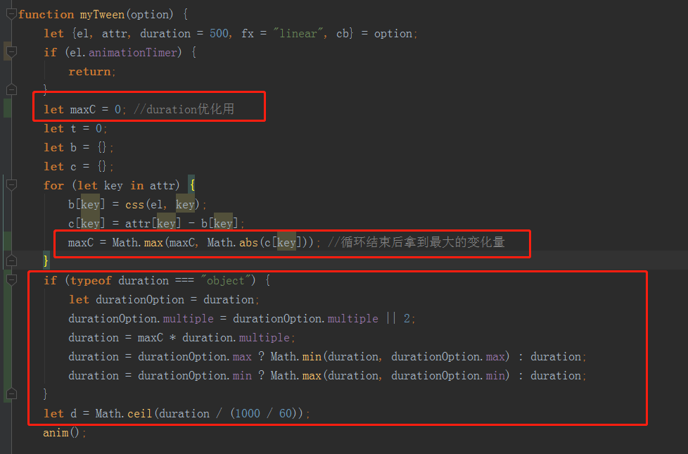

# 动画的时间设置优化(下)

> 优化
* duration设置为一个对象，multiple倍数，max最大时间，min最短时间
    ```
    duration: {
          multiple: 2,
          max: 1000,
          min: 300
    }
    ```
* multiple核心就是根据动画距离求出动画时间    
* 然后在myTween中加入逻辑，注入灵魂 

    

> 练习

* 还是之前的案例，稍作修改
    ```
    <!DOCTYPE html>
    <html lang="en">
    <head>
        <meta charset="UTF-8">
        <title>Title</title>
        <style>
            * {
                padding: 0;
                margin: 0;
            }
    
            ul, li {
                list-style: none;
            }
    
            #list > li {
                margin-top: 20px;
                width: 200px;
                font: 14px / 40px "宋体";
                text-indent: 2em;
                color: #fff;
                background-color: red;
                cursor: pointer;
            }
        </style>
    </head>
    <body>
    <ul id="list">
        <li>选项一</li>
        <li>选项二</li>
        <li>选项三</li>
    </ul>
    <script src="./myTween.js"></script>
    <script>
        {
            let list = document.querySelectorAll("#list li");
            list.forEach(item => {
                item.onmouseover = function(){
                    myTween.stop(this);
                    myTween({
                        el: this,
                        attr: {
                            width: Math.random() * (1500 - 600) + 600
                        },
                        duration: {
                            multiple: 2,
                            max: 1000,
                            min: 300
                        },
                        fx: "linear",
                    })
                };
            })
        }
    </script>
    </body>
    </html>
    ```

* 可以修改duration的各项属性调试
* 因为这边的动画给的是随机宽度，如果使用之前duration，只传入时间(number)非对象的形式,就能看出动画快的快慢的慢，
    用对象形式的优化，就能让动画看上去非常的舒服，因为根据距离的比例来计算的
    
> 目录
* [返回目录](../README.md)
* [上一章-动画的时间设置优化(上)](../13-动画的时间设置优化(上)/13-动画的时间设置优化(上).md)     
* [下一章-transform在获取时的问题](../15-transform在获取时的问题/15-transform在获取时的问题.md)     