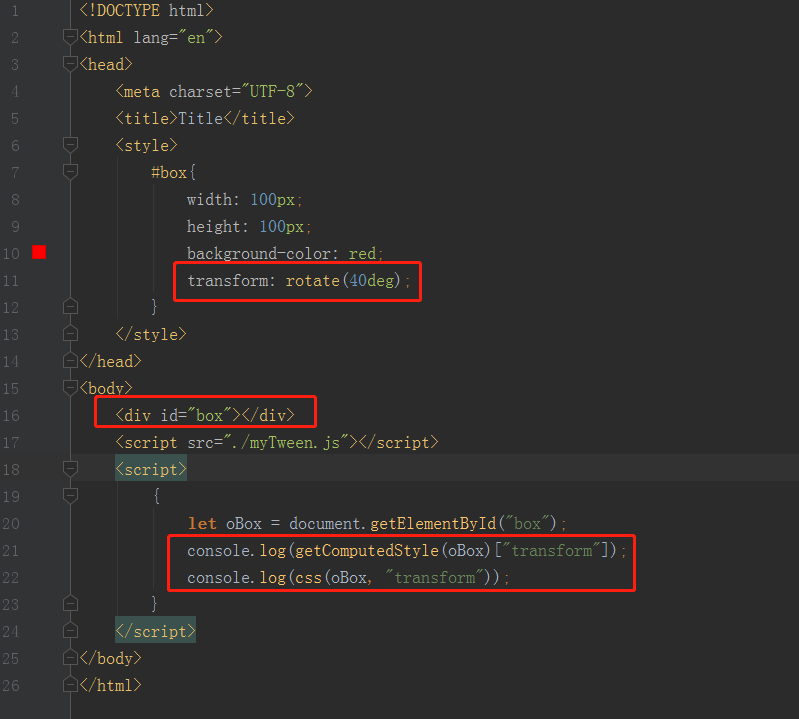
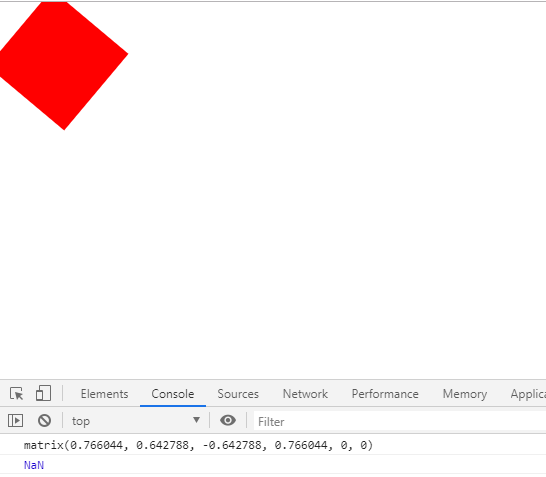
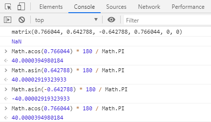

# transform在获取时的问题

> 获取时会遇到什么问题
* 我们先来看下我们写的css函数
    ```
    function css(el, attr, val) {
        if (val === undefined) {
            return parseFloat(getComputedStyle(el)[attr]);
        } else {
            if (attr === "opacity") {
                el.style[attr] = val;
                el.style.filter = `alpha(opacity=${val * 100})`;//兼容
            } else {
                el.style[attr] = val + "px";
            }
        }
    }
    ```
* 注意这里我们使用了parseFloat，其实通过getComputedStyle获取的transform属性是个矩阵

      
    
    
    
* 我们其实就是获取一个旋转过40度角的红色div的transform属性，直接打印就是矩阵，通过我们封装的css方法
    拿到的是一个NaN因为我们对一串不能解析为数字的字符串使用了parseFloat
    
* 如果对transform矩阵熟悉的话，我们也会知道旋转角度40度，相当于变化矩阵前4个参数，cos40，sin40，sin40，cos40
* 我们可以进行验证 

       
    
* 但通过这种方式获取角度明显不方便，所以我们需要对封装的myTween使用另外种方式去获取/设置transform,
    在修改前我们现在小demo中测试  
    
> 练习
* 代码如下
    ```
    <!DOCTYPE html>
    <html lang="en">
    <head>
        <meta charset="UTF-8">
        <title>Title</title>
        <style>
            #box{
                width: 100px;
                height: 100px;
                background-color: red;
                transform: rotate(40deg);
            }
        </style>
    </head>
    <body>
        <div id="box"></div>
        <script src="./myTween.js"></script>
        <script>
            const transformArr = [
                "rotate",
                "rotateX",
                "rotateY",
                "rotateZ",
                "translate",
                "translateX",
                "translateY",
                "translateZ",
                "scale",
                "scaleX",
                "scaleY",
                "scaleZ",
                "skew",
                "skewX",
                "skewY",
                "skewZ",
            ];
            function css(el, attr, val) {
                if (transformArr.includes(attr)) {
                    return transform(el, attr, val)
                }
                if (val === undefined) {
                    return parseFloat(getComputedStyle(el)[attr]);
                } else {
                    if (attr === "opacity") {
                        el.style[attr] = val;
                        el.style.filter = `alpha(opacity=${val * 100})`;//兼容
                    } else {
                        el.style[attr] = val + "px";
                    }
                }
            }
            function transform(el, attr, val) {
                console.log("在这里进行设置transform或者获取transform");
            }
            {
                let oBox = document.getElementById("box");
                console.log(css(oBox, "rotate"));
            }
        </script>
    </body>
    </html>
    ```          
* 我们先定义一个transform的css属性的数组，在css方法中一开始判断，如果是transform相关获取或者设置，
    就执行我们的transform函数   
    
> 目录
* [返回目录](../README.md)
* [上一章-动画的时间设置优化(下)](../14-动画的时间设置优化(下)/14-动画的时间设置优化(下).md)     
* [下一章-在css方法中融入transform](../16-在css方法中融入transform/16-在css方法中融入transform.md)     