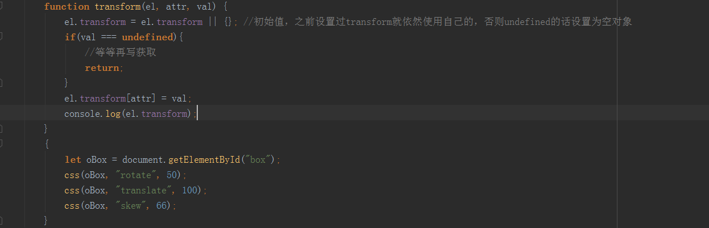
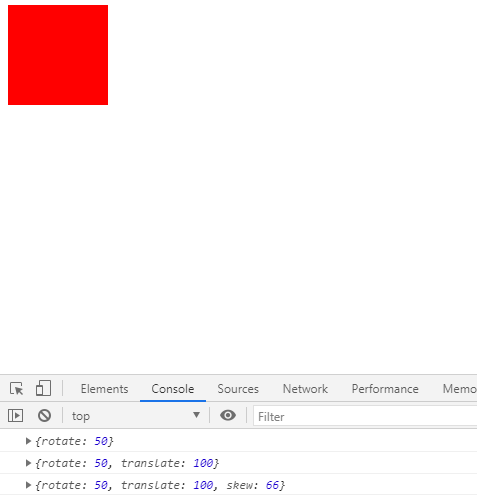

# 在css方法中融入transform

> 优化
* 我们通过js的方式，去设置元素的transform，而不通过css去设置
* 这样在元素上自定义个属性，记录transform，具体如下
    
    
    
    
    
* 然后处理设置/获取的逻辑，注意设置的时候不同的变换属性，对应的单位也不同，如旋转是角度，位移是px，缩放没有单位
    
    ```
    function transform(el, attr, val) {
        el.transform = el.transform || {}; //初始值，之前设置过transform就依然使用自己的，否则undefined的话设置为空对象
        if(val === undefined){
            return el.transform[attr];
        }
        el.transform[attr] = val;
        let transformResult = "";
        for (let key in el.transform) {
            switch(key){
                case "rotate":
                case "rotateX":
                case "rotateY":
                case "rotateZ":
                case "skew":
                case "skewX":
                case "skewY":
                case "skewZ":
                    transformResult += `${key}(${el.transform[key]}deg) `;
                    break;
                case "translate":
                case "translateX":
                case "translateY":
                case "translateZ":
                    transformResult += `${key}(${el.transform[key]}px) `;
                    break;
                case "scale":
                case "scaleX":
                case "scaleY":
                case "scaleZ":
                    transformResult += `${key}(${el.transform[key]}) `;
                    break;
            }
        }
        el.style.transform = transformResult.trim();
    }
    ``` 
    
* 注意这里有个细节问题，就是每次获取transform属性前，必须先设置，比如先给div设置个初始值，哪怕旋转至为0
    ```
    css(oBox, "rotate", 0);     
    ```      
    
> 练习
* 我们来做个旋转在位移的动画案例，具体代码如下    

    ```
    <!DOCTYPE html>
    <html lang="en">
    <head>
        <meta charset="UTF-8">
        <title>Title</title>
        <style>
            #box{
                width: 100px;
                height: 100px;
                background-color: red;
            }
        </style>
    </head>
    <body>
        <div id="box"></div>
        <script src="./myTween.js"></script>
        <script>
            {
                let oBox = document.getElementById("box");
                css(oBox, "rotate", 0);
                css(oBox, "translateY", 0);
                myTween({
                    el: oBox,
                    attr: {
                        rotate: 360
                    },
                    cb(){
                        myTween({
                            el: oBox,
                            attr: {
                                translateY: 500
                            }
                        })
                    }
                })
            }
        </script>
    </body>
    </html>
    ```
* 这里我们就能看到旋转以后再位移的动画了  

> 目录
* [返回目录](../README.md)
* [上一章-transform在获取时的问题](../15-transform在获取时的问题/15-transform在获取时的问题.md)    
* [下一章-优化css函数-特殊样式获取](../17-优化css函数-特殊样式获取/17-优化css函数-特殊样式获取.md)    