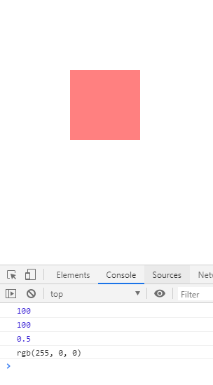

# 优化css函数-特殊样式获取

> 特殊样式获取
* 现在我们的myTween可以处理一些css样式了，如left，top，opacity等
* 还有我们前面新增加的transform的样式，如rotate，translate等
* 但还有部分样式并没有处理，就比如说我们的背景颜色
* 我们的css方法中，如果获取样式，就会用parseFloat转成数字，这里我们可以定义一个数组，
    专门为需要转成数字的样式做个属于他们的数组，例如
    ```
    const normalArr = [
        "width",
        "height",
        "marginTop",
        "marginLeft",
        "marginRight",
        "marginBottom",
        "paddingTop",
        "paddingLeft",
        "paddingRight",
        "paddingBottom",
        "left",
        "right",
        "top",
        "bottom"
    ]; //希望能转成数字的
    ```
* 我们知道getComputedStyle如果获取希望转成数字的这些样式，得到的是带单位的字符串所以要parseFloat
* 类似opacity这种获取的字符串，是没有单位的，但我们也可以转成数字
* 但background这种就不行了，所以我们这边有这么一个逻辑`(normalArr.includes(v) || !isNaN(parseFloat(v))) ? parseFloat(v) : v`    
* 上述表达式意思就是normalArr数组中的那些样式需要转成数字，像opacity这种能转成数字的也转成数字，其余的就不做转换
* 所以css函数的最终代码是这样的
    ```
    function css(el, attr, val) {
        if (transformArr.includes(attr)) {
            return transform(el, attr, val)
        }
        if (val === undefined) {
            let v = getComputedStyle(el)[attr];
            return (normalArr.includes(v) || !isNaN(parseFloat(v))) ? parseFloat(v) : v;
        } else {
            if (attr === "opacity") {
                el.style[attr] = val;
                el.style.filter = `alpha(opacity=${val * 100})`;//兼容
            } else {
                el.style[attr] = val + "px";
            }
        }
    }
    ```

> 练习
* 我们写这么一段代码
    ```
    <!DOCTYPE html>
    <html lang="en">
    <head>
        <meta charset="UTF-8">
        <title>Title</title>
        <style>
            #box{
                position: absolute;
                left: 100px;
                top: 100px;
                width: 100px;
                height: 100px;
                background-color: red;
                opacity: .5;
            }
        </style>
    </head>
    <body>
        <div id="box"></div>
        <script src="./myTween.js"></script>
        <script>
            {
                let oBox = document.querySelector("#box");
                console.log(css(oBox, "left"));
                console.log(css(oBox, "height"));
                console.log(css(oBox, "opacity"));
                console.log(css(oBox, "backgroundColor"));
            }
        </script>
    </body>
    </html>
    ```
* 打开控制台就能看到 

       
    
> 目录
* [返回目录](../README.md)
* [上一章-在css方法中融入transform](../16-在css方法中融入transform/16-在css方法中融入transform.md)     
* [下一章-样式的批量设置](../18-样式的批量设置/18-样式的批量设置.md)     