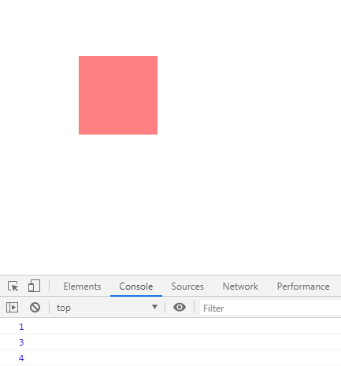
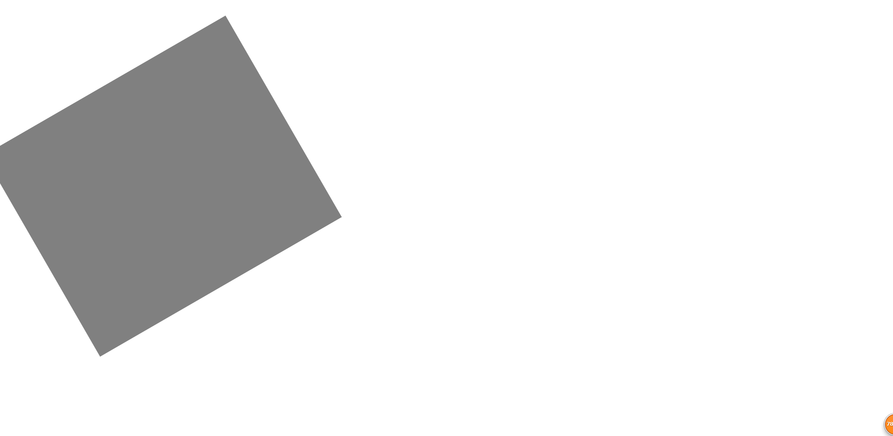

# 样式的批量设置

> 知识大纲
* 上一章我们优化了获取样式，这章在优化下设置
* 先来看下我们之前设置的代码
    ```
    if (attr === "opacity") {
        el.style[attr] = val;
        el.style.filter = `alpha(opacity=${val * 100})`;//兼容
    } else {
        el.style[attr] = val + "px";
    }
    ```
* 在这里我们opacity就不做处理了，加单位的这个else语句块添加条件，就是我们之前的normalArr
* 然后在处理下我们的其他样式，具体代码如下
    ```
    if (attr === "opacity") {
        el.style[attr] = val;
        el.style.filter = `alpha(opacity=${val * 100})`;//兼容
    } else if (normalArr.includes(attr)) {
        el.style[attr] = val + "px";
    } else if (attr === "zIndex") {
        el.style[attr] = Math.round(val);
    } else {
        el.style[attr] = val;
    }
    ```   
 
* 注意z-index的设置因为不支持小数，所以这里使用了四舍五入的方式
 
* 我们接着优化，处理下批量设置,在css方法中加入这个判断
 
    ```
    if (typeof attr === "object") {
        //批量设置
        for(let key in attr){
            css(el, key, attr[key]);
        }
        return;
    }
    ```
    
> 练习
* 我们来调戏下z-index
    ```
    <!DOCTYPE html>
    <html lang="en">
    <head>
        <meta charset="UTF-8">
        <title>Title</title>
        <style>
            #box{
                position: absolute;
                left: 100px;
                top: 100px;
                width: 100px;
                height: 100px;
                background-color: red;
                opacity: .5;
                z-index: 1;
            }
        </style>
    </head>
    <body>
    <div id="box"></div>
    <script src="./myTween.js"></script>
    <script>
        {
            let oBox = document.querySelector("#box");
            console.log(css(oBox, "zIndex"));
            css(oBox, "zIndex", 2.8);
            console.log(css(oBox, "zIndex"));
            css(oBox, "zIndex", 4.1);
            console.log(css(oBox, "zIndex"));
        }
    </script>
    </body>
    </html>
    ```    

* 打开控制台看下效果前，考虑下我们写的代码，使用了Math.round来进行四舍五入，所以答案应该是1,3,4
    在来验证我们的答案吧    
    
    
    
* 在来试下批量设置   
    ```
    css(oBox, {
        width: 500,
        height: 600,
        background: "black",
        rotate: 60
    })
    ``` 
* 然后就能看到效果啦
    
        
    
> 目录
* [返回目录](../README.md)
* [上一章-优化css函数-特殊样式获取](../17-优化css函数-特殊样式获取/17-优化css函数-特殊样式获取.md)      
* [下一章-抖动原理说明](../19-抖动原理说明/19-抖动原理说明.md)      