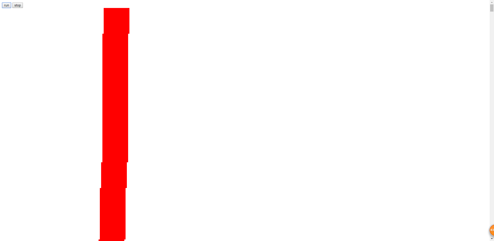
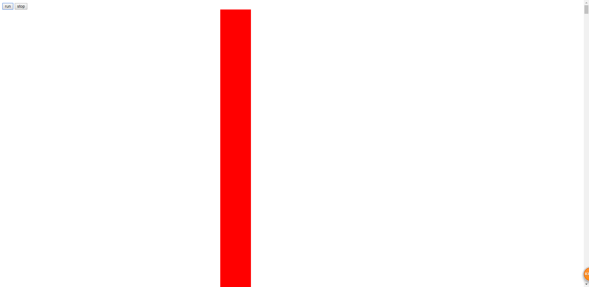

# 动画帧制作动画的优势(下)

> 练习
* 之前用定时器做了动画，这次我们用动画帧直接操练，具体代码如下
    ```html
    <!DOCTYPE html>
    <html lang="en">
    <head>
        <meta charset="UTF-8">
        <title>Title</title>
        <style>
            #box{
                position: absolute;
                left: 0;
                top: 100px;
                width: 100px;
                height: 100px;
                background-color: red;
            }
        </style>
    </head>
    <body>
        <button>run</button>
        <button>stop</button>
        <div id="box"></div>
        <script>
            (function(){
                let aBtn = document.querySelectorAll("button");
                let oBox = document.querySelector("#box");
                let timer = 0;
                aBtn[0].onclick = function(){
                    move();
                };
                aBtn[1].onclick = function(){
                    cancelAnimationFrame(timer);
                };
    
                function move(){
                    cancelAnimationFrame(timer);
                    timer = requestAnimationFrame(function(){
                        let l = parseFloat(getComputedStyle(oBox)["left"]);
                        oBox.style.left = l + 5 + "px";
                        move();
                    })
                }
            })();
        </script>
    </body>
    </html>
    ```
* 我们首先发现requestAnimationFrame不用设置间隔，其次要使用递归，否则只绘制动画的一帧
* 当屏幕渲染时，会通知这帧所有的动画帧该执行了

* 接下来我们在来写点案例来对比下定时器和动画帧 
    1. setInterval 
        * 代码如下
            ```html
            <!DOCTYPE html>
            <html lang="en">
            <head>
                <meta charset="UTF-8">
                <title>Title</title>
                <style>
                    #box{
                        position: relative;
            
                    }
                    #box div{
                        position: absolute;
                        left: 0;
                        width: 100px;
                        height: 100px;
                        background-color: red;
                    }
                </style>
            </head>
            <body>
            <button>run</button>
            <button>stop</button>
            <div id="box"></div>
            <script>
                (function(){
                    let box = document.querySelector("#box");
                    let inner = "";
                    for (let i = 0; i < 300; i++) {
                        inner += `<div style="top: ${i * 100}px"></div>`;
                    }
                    box.innerHTML = inner;
            
                    let aBtn = document.querySelectorAll("button");
                    let aDiv = box.querySelectorAll("div");
            
                    aBtn[0].onclick = function(){
                        aDiv.forEach(item => {
                            setInterval(function(){
                                let l = parseFloat(getComputedStyle(item)["left"]);
                                item.style.left = l + 5 + "px";
                            }, 1000/60)
                        })
                    };
                })();
            </script>
            </body>
            </html>
            ``` 
        * 截图如下
            
            
            
    2. requestAnimationFrame
        * 代码如下       
            ```
            <!DOCTYPE html>
            <html lang="en">
            <head>
                <meta charset="UTF-8">
                <title>Title</title>
                <style>
                    #box{
                        position: relative;
            
                    }
                    #box div{
                        position: absolute;
                        left: 0;
                        width: 100px;
                        height: 100px;
                        background-color: red;
                    }
                </style>
            </head>
            <body>
            <button>run</button>
            <button>stop</button>
            <div id="box"></div>
            <script>
                (function(){
                    let box = document.querySelector("#box");
                    let inner = "";
                    for (let i = 0; i < 300; i++) {
                        inner += `<div style="top: ${i * 100}px"></div>`;
                    }
                    box.innerHTML = inner;
            
                    let aBtn = document.querySelectorAll("button");
                    let aDiv = box.querySelectorAll("div");
            
                    aBtn[0].onclick = function(){
                        aDiv.forEach(item => {
                            move(item);
                        })
                    };
            
                    function move(div){
                        requestAnimationFrame(function(){
                            let l = parseFloat(getComputedStyle(div)["left"]);
                            div.style.left = l + 5 + "px";
                            move(div);
                        })
                    }
                })();
            </script>
            </body>
            </html>

            ``` 
        * 截图如下
        
                
        
 
> 目录
* [返回目录](../README.md)
* [上一章-动画帧制作动画的优势(上)](../1-动画帧制作动画的优势(上)/1-动画帧制作动画的优势(上).md)   
* [下一章-利用动画帧做动画](../3-利用动画帧做动画/3-利用动画帧做动画.md)   
 
              