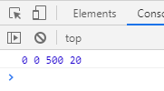
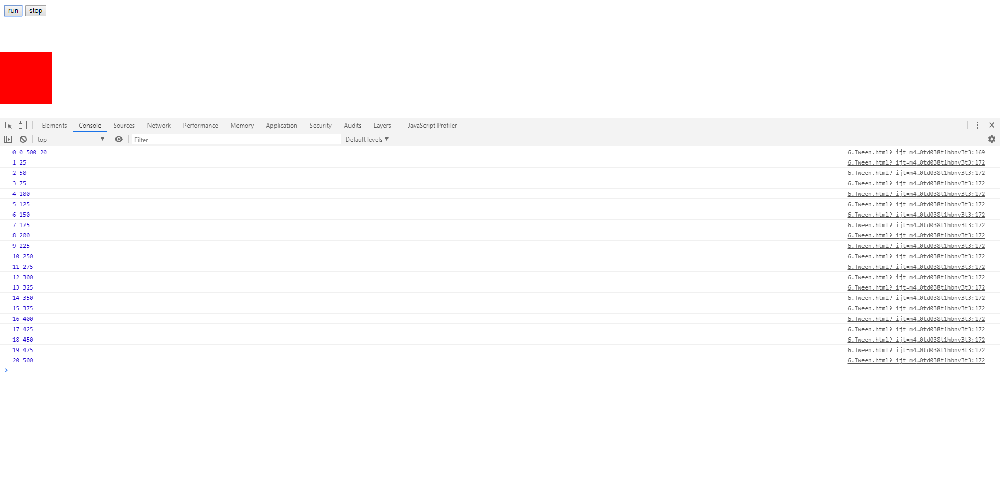
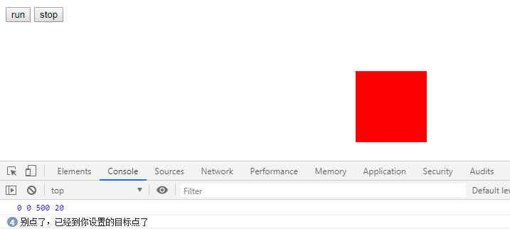
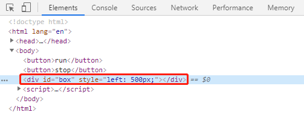

# Tween的运动算法(上)

> 知识大纲
* Tween是一套运动算法，[Tween长撒样](./Tween.js)
* 方法的四个参数
    1. t - 当前时间
    2. b - 初始值
    3. c - 变化量
    4. d - 持续时间
    
> 练习
* 我们先来模拟下这4个参数，先来看代码
    ```html
    <!DOCTYPE html>
    <html lang="en">
    <head>
        <meta charset="UTF-8">
        <title>Title</title>
        <style>
            #box{
                position: absolute;
                left: 0;
                top: 100px;
                width: 100px;
                height: 100px;
                background-color: red;
            }
        </style>
    </head>
    <body>
    <button>run</button>
    <button>stop</button>
    <div id="box"></div>
    <script>
        const Tween = {
            linear: function (t, b, c, d) {  //匀速
                return c * t / d + b;
            },
            easeIn: function (t, b, c, d) {  //加速曲线
                return c * (t /= d) * t + b;
            },
            easeOut: function (t, b, c, d) {  //减速曲线
                return -c * (t /= d) * (t - 2) + b;
            },
            easeBoth: function (t, b, c, d) {  //加速减速曲线
                if ((t /= d / 2) < 1) {
                    return c / 2 * t * t + b;
                }
                return -c / 2 * ((--t) * (t - 2) - 1) + b;
            },
            easeInStrong: function (t, b, c, d) {  //加加速曲线
                return c * (t /= d) * t * t * t + b;
            },
            easeOutStrong: function (t, b, c, d) {  //减减速曲线
                return -c * ((t = t / d - 1) * t * t * t - 1) + b;
            },
            easeBothStrong: function (t, b, c, d) {  //加加速减减速曲线
                if ((t /= d / 2) < 1) {
                    return c / 2 * t * t * t * t + b;
                }
                return -c / 2 * ((t -= 2) * t * t * t - 2) + b;
            },
            elasticIn: function (t, b, c, d, a, p) {  //正弦衰减曲线（弹动渐入）
                if (t === 0) {
                    return b;
                }
                if ((t /= d) == 1) {
                    return b + c;
                }
                if (!p) {
                    p = d * 0.3;
                }
                if (!a || a < Math.abs(c)) {
                    a = c;
                    var s = p / 4;
                } else {
                    var s = p / (2 * Math.PI) * Math.asin(c / a);
                }
                return -(a * Math.pow(2, 10 * (t -= 1)) * Math.sin((t * d - s) * (2 * Math.PI) / p)) + b;
            },
            elasticOut: function (t, b, c, d, a, p) {    //正弦增强曲线（弹动渐出）
                if (t === 0) {
                    return b;
                }
                if ((t /= d) == 1) {
                    return b + c;
                }
                if (!p) {
                    p = d * 0.3;
                }
                if (!a || a < Math.abs(c)) {
                    a = c;
                    var s = p / 4;
                } else {
                    var s = p / (2 * Math.PI) * Math.asin(c / a);
                }
                return a * Math.pow(2, -10 * t) * Math.sin((t * d - s) * (2 * Math.PI) / p) + c + b;
            },
            elasticBoth: function (t, b, c, d, a, p) {
                if (t === 0) {
                    return b;
                }
                if ((t /= d / 2) == 2) {
                    return b + c;
                }
                if (!p) {
                    p = d * (0.3 * 1.5);
                }
                if (!a || a < Math.abs(c)) {
                    a = c;
                    var s = p / 4;
                }
                else {
                    var s = p / (2 * Math.PI) * Math.asin(c / a);
                }
                if (t < 1) {
                    return -0.5 * (a * Math.pow(2, 10 * (t -= 1)) *
                        Math.sin((t * d - s) * (2 * Math.PI) / p)) + b;
                }
                return a * Math.pow(2, -10 * (t -= 1)) *
                    Math.sin((t * d - s) * (2 * Math.PI) / p) * 0.5 + c + b;
            },
            backIn: function (t, b, c, d, s) {     //回退加速（回退渐入）
                if (typeof s == 'undefined') {
                    s = 1.70158;
                }
                return c * (t /= d) * t * ((s + 1) * t - s) + b;
            },
            backOut: function (t, b, c, d, s) {
                if (typeof s == 'undefined') {
                    s = 1.70158;
                }
                return c * ((t = t / d - 1) * t * ((s + 1) * t + s) + 1) + b;
            },
            backBoth: function (t, b, c, d, s) {
                if (typeof s == 'undefined') {
                    s = 1.70158;
                }
                if ((t /= d / 2) < 1) {
                    return c / 2 * (t * t * (((s *= (1.525)) + 1) * t - s)) + b;
                }
                return c / 2 * ((t -= 2) * t * (((s *= (1.525)) + 1) * t + s) + 2) + b;
            },
            bounceIn: function (t, b, c, d) {    //弹球减振（弹球渐出）
                return c - Tween['bounceOut'](d - t, 0, c, d) + b;
            },
            bounceOut: function (t, b, c, d) {//*
                if ((t /= d) < (1 / 2.75)) {
                    return c * (7.5625 * t * t) + b;
                } else if (t < (2 / 2.75)) {
                    return c * (7.5625 * (t -= (1.5 / 2.75)) * t + 0.75) + b;
                } else if (t < (2.5 / 2.75)) {
                    return c * (7.5625 * (t -= (2.25 / 2.75)) * t + 0.9375) + b;
                }
                return c * (7.5625 * (t -= (2.625 / 2.75)) * t + 0.984375) + b;
            },
            bounceBoth: function (t, b, c, d) {
                if (t < d / 2) {
                    return Tween['bounceIn'](t * 2, 0, c, d) * 0.5 + b;
                }
                return Tween['bounceOut'](t * 2 - d, 0, c, d) * 0.5 + c * 0.5 + b;
            }
        };
        (function(){
            if(!window.requestAnimationFrame){
                //说明这个是低版本
                window.requestAnimationFrame = function(callback){
                    return setTimeout(callback, 1000 / 60)
                };
                window.cancelAnimationFrame = function(index){
                    clearTimeout(index);
                };
            }
            let aBtn = document.querySelectorAll("button");
            let oBox = document.querySelector("#box");
            let timer = 0;
            let t = 0;
            let b = parseFloat(getComputedStyle(oBox)["left"]);
            let target = 500;
            let c = target - b;
            let d = 20;
            console.log(t, b, c, d);
            aBtn[0].onclick = function(){
    
            };
            aBtn[1].onclick = function(){
    
            };
        })();
    </script>
    </body>
    </html>
    ```  
* 案例还是之前那个，主要还是这里设置的4个参数的意义
    1. t - 当前时间，我们可以把这个当做当前第几次动画，初始值为第0次
    2. b - 初始值，那这个在我们本案例中就是我们box元素的初始left的值      
    3. c - 变化值，我们设置了个目标位置500，因为本案例恰巧初始值是0，所以变化值是500，
        但计算的方式，仍然应该是目标点-初始值=变化值
    4. d - 持续时间，我们可以把这个当做动画一共要执行几次，这里设置为20次
* 之后打开控制台就能看到这里的四个参数分别打印了
    
        

* 其实简单的理解就是，希望动画走完20次以后到达目标的地方500  

* 接下来我们给run按钮添加逻辑

    ```
        aBtn[0].onclick = function(){
            t++;
            console.log(t, Tween.linear(t,b,c,d));
        };
    ```
* 我们先模拟下每点击一次走一次，就是按run按钮，理论上按20次就应该到500了，
    这里为了教学，我是真的按了20次，小伙伴们调试其实按几次看下结果就知道了 
    
        
    
* 前面忘记说了linear是Tween里最简单的运动公式，就是我们的匀速运动啦，原理搞懂以后我们就可以
    接着写我们的代码了    
    ```
        aBtn[0].onclick = function(){
            t++;
            // console.log(t, Tween.linear(t,b,c,d));
            if(t <= d){
                let l = Tween.linear(t,b,c,d);
                oBox.style.left = l + "px";
            }else{
                console.log("别点了，已经到你设置的目标点了")
            }
        };
    ```  
* 其实就是给box添加了样式，依然用点击的方式看下效果   

       
    
    
    
* 到这里想必小伙伴都忍不了了吧，可以开始写动画了吧，在通过鼠标点击，让元素走到目标点，肯定要砸电脑了啊，
    那我们在下一章用requestAnimationFrame搞起~

> 目录
* [返回目录](../README.md)
* [上一章-动画帧兼容](../4-动画帧兼容/4-动画帧兼容.md)       
