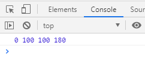

# 封装运动框架-基础版

> 封装前应该考虑什么
1. 封装一个函数，调用用来实现我们的动画
2. 考虑需要哪些参数
    1. el - 元素
        * 肯定需要元素，我们要给什么元素做动画
    2. attr - 属性
        * 接下去就是要给这个元素的哪个属性做动画，先做个简单的，
            比如现在我们可以先不考虑多个属性做动画
    3. target - 目标值
        * 该属性最终要达到的结果
    4. duration - 时长
        * 之前我们用的是动画总共的次数，其实一般是传毫秒数的
        * 比如2000，指的就是动画时长2000毫秒，到达目标点
    5. fx - 动画形式
        * Tween里面不一样的运动公式    
       
> 练习
* 一步一步来，先来调试下下面的代码
    ```
    <!DOCTYPE html>
    <html lang="en">
    <head>
        <meta charset="UTF-8">
        <title>Title</title>
        <style>
            #box {
                position: absolute;
                left: 0;
                top: 100px;
                width: 100px;
                height: 100px;
                background-color: red;
            }
        </style>
    </head>
    <body>
    <button>run</button>
    <button>stop</button>
    <div id="box"></div>
    <script>
        const Tween = {
            linear: function (t, b, c, d) {  //匀速
                return c * t / d + b;
            },
            easeIn: function (t, b, c, d) {  //加速曲线
                return c * (t /= d) * t + b;
            },
            easeOut: function (t, b, c, d) {  //减速曲线
                return -c * (t /= d) * (t - 2) + b;
            },
            easeBoth: function (t, b, c, d) {  //加速减速曲线
                if ((t /= d / 2) < 1) {
                    return c / 2 * t * t + b;
                }
                return -c / 2 * ((--t) * (t - 2) - 1) + b;
            },
            easeInStrong: function (t, b, c, d) {  //加加速曲线
                return c * (t /= d) * t * t * t + b;
            },
            easeOutStrong: function (t, b, c, d) {  //减减速曲线
                return -c * ((t = t / d - 1) * t * t * t - 1) + b;
            },
            easeBothStrong: function (t, b, c, d) {  //加加速减减速曲线
                if ((t /= d / 2) < 1) {
                    return c / 2 * t * t * t * t + b;
                }
                return -c / 2 * ((t -= 2) * t * t * t - 2) + b;
            },
            elasticIn: function (t, b, c, d, a, p) {  //正弦衰减曲线（弹动渐入）
                if (t === 0) {
                    return b;
                }
                if ((t /= d) == 1) {
                    return b + c;
                }
                if (!p) {
                    p = d * 0.3;
                }
                if (!a || a < Math.abs(c)) {
                    a = c;
                    var s = p / 4;
                } else {
                    var s = p / (2 * Math.PI) * Math.asin(c / a);
                }
                return -(a * Math.pow(2, 10 * (t -= 1)) * Math.sin((t * d - s) * (2 * Math.PI) / p)) + b;
            },
            elasticOut: function (t, b, c, d, a, p) {    //正弦增强曲线（弹动渐出）
                if (t === 0) {
                    return b;
                }
                if ((t /= d) == 1) {
                    return b + c;
                }
                if (!p) {
                    p = d * 0.3;
                }
                if (!a || a < Math.abs(c)) {
                    a = c;
                    var s = p / 4;
                } else {
                    var s = p / (2 * Math.PI) * Math.asin(c / a);
                }
                return a * Math.pow(2, -10 * t) * Math.sin((t * d - s) * (2 * Math.PI) / p) + c + b;
            },
            elasticBoth: function (t, b, c, d, a, p) {
                if (t === 0) {
                    return b;
                }
                if ((t /= d / 2) == 2) {
                    return b + c;
                }
                if (!p) {
                    p = d * (0.3 * 1.5);
                }
                if (!a || a < Math.abs(c)) {
                    a = c;
                    var s = p / 4;
                }
                else {
                    var s = p / (2 * Math.PI) * Math.asin(c / a);
                }
                if (t < 1) {
                    return -0.5 * (a * Math.pow(2, 10 * (t -= 1)) *
                        Math.sin((t * d - s) * (2 * Math.PI) / p)) + b;
                }
                return a * Math.pow(2, -10 * (t -= 1)) *
                    Math.sin((t * d - s) * (2 * Math.PI) / p) * 0.5 + c + b;
            },
            backIn: function (t, b, c, d, s) {     //回退加速（回退渐入）
                if (typeof s == 'undefined') {
                    s = 1.70158;
                }
                return c * (t /= d) * t * ((s + 1) * t - s) + b;
            },
            backOut: function (t, b, c, d, s) {
                if (typeof s == 'undefined') {
                    s = 1.70158;
                }
                return c * ((t = t / d - 1) * t * ((s + 1) * t + s) + 1) + b;
            },
            backBoth: function (t, b, c, d, s) {
                if (typeof s == 'undefined') {
                    s = 1.70158;
                }
                if ((t /= d / 2) < 1) {
                    return c / 2 * (t * t * (((s *= (1.525)) + 1) * t - s)) + b;
                }
                return c / 2 * ((t -= 2) * t * (((s *= (1.525)) + 1) * t + s) + 2) + b;
            },
            bounceIn: function (t, b, c, d) {    //弹球减振（弹球渐出）
                return c - Tween['bounceOut'](d - t, 0, c, d) + b;
            },
            bounceOut: function (t, b, c, d) {//*
                if ((t /= d) < (1 / 2.75)) {
                    return c * (7.5625 * t * t) + b;
                } else if (t < (2 / 2.75)) {
                    return c * (7.5625 * (t -= (1.5 / 2.75)) * t + 0.75) + b;
                } else if (t < (2.5 / 2.75)) {
                    return c * (7.5625 * (t -= (2.25 / 2.75)) * t + 0.9375) + b;
                }
                return c * (7.5625 * (t -= (2.625 / 2.75)) * t + 0.984375) + b;
            },
            bounceBoth: function (t, b, c, d) {
                if (t < d / 2) {
                    return Tween['bounceIn'](t * 2, 0, c, d) * 0.5 + b;
                }
                return Tween['bounceOut'](t * 2 - d, 0, c, d) * 0.5 + c * 0.5 + b;
            }
        };
        (function () {
            if (!window.requestAnimationFrame) {
                //说明这个是低版本
                window.requestAnimationFrame = function (callback) {
                    return setTimeout(callback, 1000 / 60)
                };
                window.cancelAnimationFrame = function (index) {
                    clearTimeout(index);
                };
            }
        })();
    
        function myTween(el, attr, target, duration, fx) {
            let t = 0;
            let b = parseFloat(getComputedStyle(el)[attr]);
            let c = target - b;
            let d = duration / (1000 / 60);
            console.log(t, b, c, d);
        }
    
        (function () {
            let aBtn = document.querySelectorAll("button");
            let oBox = document.querySelector("#box");
            aBtn[0].onclick = function () {
                myTween(oBox, "top", 200, 3000, "linear");
            }
        })()
    </script>
    </body>
    </html>
    ``` 

* 几个参数的逻辑我们在来整理下
    1. t首先默认是0，这个应该没什么问题
    2. b作为初始值，所以我们这边通过getComputedStyle去获取，注意这里拿到的是字符串，
        所以前面用parseFloat转成数值
    3. c其实也没什么问题，就是用目标值-初始值
    4. 主要是d这里的逻辑，因为我们这边传入的是毫秒数，比如3000毫秒应该执行几次动画，
        我们以浏览器的刷新频率来说，1s中60帧，所以除以1000后在乘以60(和除以(1000 / 60)等价)，
        拿这里的3000举例子，所以就是要执行180次动画

* 我们这里的例子用的是box向下匀速移动到200的距离，用3s的时间
    1. 所以方法调用是这么写的`myTween(oBox, "top", 200, 3000, "linear");` 
    2. 注意看我们一开始的样式，box就给了top值，初始值是100
    3. 我们目标是200，初始值是100，所以change的值就是200-100=100
    4. d的逻辑在上面已经分析过了，这里就不赘述了
    5. 所以控制台最终打印的结果是
    
           
        
    6. 这里的d其实还可以做个优化处理，因为可能会出现小数，总共执行次数不可能为小数，
        所以可以向上取整，代码就是`let d = Math.ceil(duration / (1000 / 60));`     
        
* 接下去就是写我们熟悉的requestAnimationFrame
    ```
        function myTween(el, attr, target, duration, fx) {
            let t = 0;
            let b = parseFloat(getComputedStyle(el)[attr]);
            let c = target - b;
            let d = Math.ceil(duration / (1000 / 60));
            // console.log(t, b, c, d);
            let timer = 0;
            anim();
            function anim() {
                t++;
                if (t > d) {
                    //动画结束
                    cancelAnimationFrame(timer);
                } else {
                    let val = Tween[fx](t, b, c, d);
                    el.style[attr] = val + "px";
                    timer = requestAnimationFrame(anim);
                }
            }
        }
    ```  
* 然后测试一把，果然盒子可以往下做动画了，我们还可以更改目标值，时长，以及选择不同的运动公式
    看下结果，美滋滋
    
> 目录
* [返回目录](../README.md)
* [上一章-Tween的运动算法(下)](../6-Tween的运动算法(下)/6-Tween的运动算法(下).md)       
                                           
        